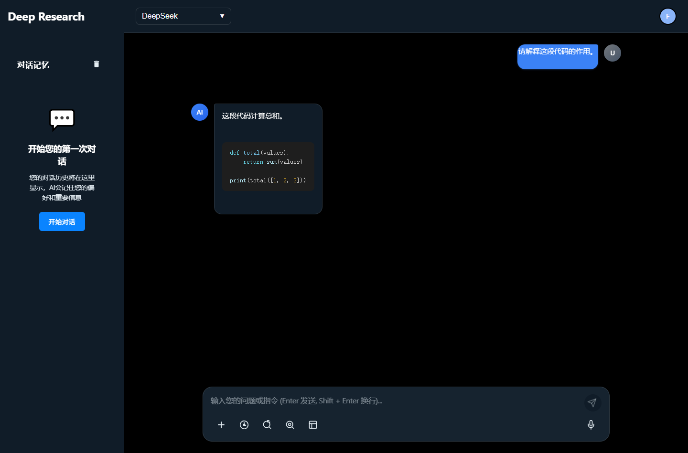
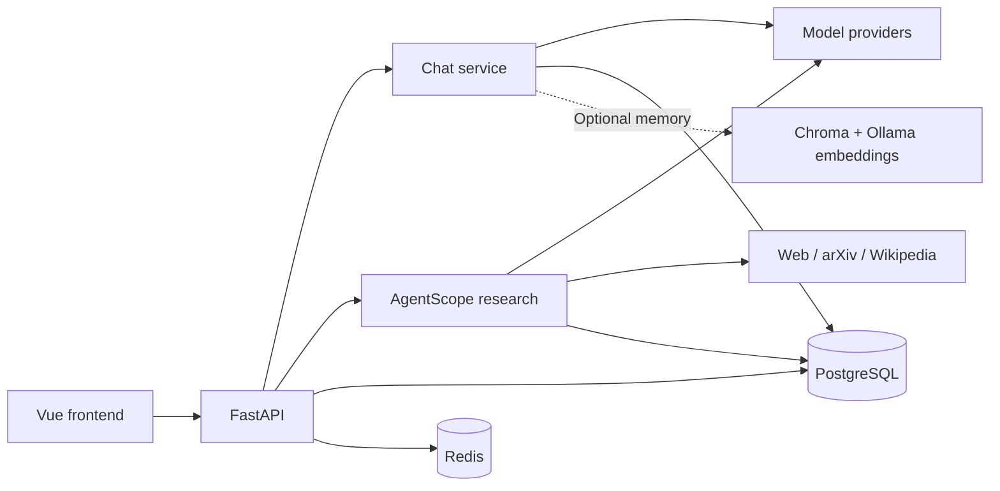

# Deep Research

Deep Research is a self-hosted AI application for asking questions, exploring web and academic sources, and turning findings into research reports with citations. It brings streaming chat, image analysis, saved conversations, and research evidence into one browser interface.

The default model is **`deepseek-flash`**, configured as a vision-language model (VLM) for text and image analysis. DeepSeek, Zhipu/BigModel, and Ollama integrations share a provider abstraction. The Vue interface supports light and dark modes with blue, teal, and slate styling.

## Project overview

Use the project for technical investigations, literature exploration, document discussions, or ongoing conversations with optional personal memory. A typical research session starts with a question, gathers information through AgentScope tools, and saves a report alongside its citations and evidence for later review.

| Capability | What you can do |
| --- | --- |
| Chat and reasoning | Stream replies, select models, and switch between regular chat, deep thinking, web search, and deep research. |
| Research with sources | Use web search, arXiv, and Wikipedia tools to gather findings and generate structured Markdown reports. |
| Research lifecycle | Watch progress, stop active research, and use the API to resume interrupted work from saved request/checkpoint data. |
| Text and image uploads | Add document text or VLM image descriptions to a conversation and retain uploaded content. |
| Conversation history | Reopen saved chats; edit or regenerate a saved turn in a new branch while keeping the original conversation. |
| Evidence review | Inspect source links, mark evidence as used, and record your verification. Unmeasured scores display as “未评估”. |
| Sharing and feedback | Create expiring public conversation snapshots, submit message feedback, and report content. Owners can revoke shares through the API. |
| Optional memory | Extract useful facts from conversations and retrieve them in later chats with PostgreSQL, Chroma, and Redis. |
| Account isolation | Register and sign in; conversations, research, uploads, and feedback are scoped to their owner. |

## Interface preview



The preview uses disposable demo content. See the [landing page](frontend/tests/blue-teal-landing-final.png) and [light-mode settings](frontend/tests/blue-teal-settings-light.png) for more views.

## Technology and architecture

| Layer | Technology and role |
| --- | --- |
| Frontend | Vue 3, Vite, Pinia, and Vue Router; Markdown rendering and syntax highlighting |
| API | FastAPI, Pydantic, and Uvicorn; authenticated REST, SSE, and WebSocket endpoints |
| Research | AgentScope agents and tools, with asynchronous provider clients |
| Models | DeepSeek, Zhipu/BigModel, and Ollama through `BaseLLM` |
| Persistence | PostgreSQL queried with asyncpg; SQLAlchemy model declarations |
| Security and cache | Salted password hashes, JWT access/refresh tokens, and Redis for revocation, rotation, quotas, and caches |
| Optional memory | Chroma vector storage, Ollama embeddings, and DeepSeek fact extraction/HyDE query expansion |



Source code follows **API → service → core → repository**. See [architecture and conventions](docs/architecture.md) for details.

```text
deep-research/
├── backend/
│   ├── main.py          # API entry point and startup/shutdown
│   ├── api/             # HTTP, SSE, and WebSocket routes
│   ├── services/        # Chat, research, and document workflows
│   ├── core/            # Models, agents, memory, security, and TTS
│   ├── repositories/    # Database queries and schema initialization
│   ├── models/          # SQLAlchemy declarations
│   └── schemas/         # Request and response validation
├── frontend/            # Vue application and frontend tests
├── tests/               # Regression tests, fixtures, and opt-in live checks
├── docs/                # Architecture, provider references, and audit evidence
├── scripts/             # Check runner and cache cleanup
├── app.py               # Compatible app:app entry point
├── .env.example         # Backend configuration template
└── requirements*.txt    # Runtime/dev dependencies and transitive lock
```

## Quick start

The commands below use Windows PowerShell, the validated development environment. You need Python 3.12, Node.js 20.19+ or 22.12+, a running PostgreSQL server, and Redis. Configure a model provider account/endpoint for model requests. Ollama is optional unless you enable local models or memory embeddings.

### 1. Install the backend dependencies

```powershell
git clone https://github.com/quitedob/deep-research.git
cd deep-research
py -3.12 -m venv .venv
.venv/Scripts/python.exe -m pip install -r requirements-dev.txt
Copy-Item .env.example .env
```

`requirements-dev.txt` includes the runtime dependencies and development checks. `requirements-lock.txt` records the complete validated Python environment.

### 2. Configure services and credentials

Edit the root `.env` using the [configuration reference](#configuration) below. Set `JWT_SECRET_KEY`, PostgreSQL and Redis connection values, and `DEEPSEEK_API_KEY`. Generate a JWT secret locally:

```powershell
.venv/Scripts/python.exe -c "import secrets; print(secrets.token_urlsafe(48))"
```

Paste the generated value into `JWT_SECRET_KEY`. For the initial setup, keep the default VLM and disable optional memory until its embedding stack is ready:

```dotenv
DEEPSEEK_DEFAULT_MODEL=deepseek-flash
MEMORY_ENABLED=false
```

Research web search also needs `WEB_SEARCH_API_KEY` or `BIGMODEL_API_KEY`. Credentials belong in your local environment; `.env` is ignored by Git.

The PostgreSQL user must be able to connect to the `postgres` maintenance database and create tables in the application database. Startup creates the application database if it is missing and the user has permission; otherwise, create it beforehand using the configured `DB_NAME`.

### 3. Start the backend

From the repository root:

```powershell
.venv/Scripts/python.exe -m uvicorn backend.main:app --host 127.0.0.1 --port 8000
```

Alternatively, `.venv/Scripts/python.exe app.py` uses `API_HOST`, `API_PORT`, and `API_RELOAD` from the environment.

### 4. Start the frontend

Open a second terminal at the repository root:

```powershell
cd frontend
npm ci
Copy-Item .env.example .env
npm run dev
```

| Address | Purpose |
| --- | --- |
| `http://localhost:3000` | Browser application |
| `http://127.0.0.1:8000/docs` | Interactive API documentation |
| `http://127.0.0.1:8000/redoc` | API reference |
| `http://127.0.0.1:8000/health` | API health endpoint |

### 5. Start a conversation or research task

1. Register an account and sign in. The interface currently uses Chinese labels.
2. Select a model and enter a question. Use **深度思考**, **联网搜索**, or **深度研究** for the corresponding mode.
3. Use the **+** menu to upload a supported text file or image; the extracted content is added to the message input.
4. Review a completed research report and expand **研究证据** to inspect its sources. Saved conversations appear in history.
5. Use a saved message's edit/regenerate action to create a branch, or share the conversation as an expiring snapshot.

## Configuration

The complete templates are [backend `.env.example`](.env.example) and [frontend `.env.example`](frontend/.env.example).

| Variable(s) | Purpose |
| --- | --- |
| `JWT_SECRET_KEY` | Required stable secret of at least 32 bytes for signing tokens |
| `ACCESS_TOKEN_EXPIRE_MINUTES`, `REFRESH_TOKEN_EXPIRE_DAYS` | Access and refresh lifetimes; template defaults are 30 minutes and 7 days |
| `DATABASE_URL` or `DB_HOST`, `DB_PORT`, `DB_USER`, `DB_PASSWORD`, `DB_NAME` | PostgreSQL connection; `DATABASE_URL` takes precedence |
| `REDIS_HOST`, `REDIS_PORT`, `REDIS_PASSWORD`, `REDIS_DB` | Required Redis connection |
| `DEEPSEEK_API_KEY`, `DEEPSEEK_BASE_URL`, `DEEPSEEK_DEFAULT_MODEL` | Default model provider; the exact model identifier is sent to the configured endpoint |
| `WEB_SEARCH_API_KEY`, `BIGMODEL_API_KEY` | BigModel web search credentials; `BIGMODEL_API_KEY` also configures Zhipu models |
| `ZHIPU_BASE_URL`, `ZHIPU_DEFAULT_MODEL` | Alternative Zhipu provider settings |
| `OLLAMA_BASE_URL`, `OLLAMA_DEFAULT_MODEL` | Local Ollama model settings |
| `MEMORY_ENABLED` | Enable optional personal memory; set `false` for a setup without the memory stack |
| `OLLAMA_EMBEDDING_MODEL`, `CHROMA_PERSIST_DIR` | Memory embedding model and vector storage location |
| `RESEARCH_TIMEOUT_SECONDS`, `RESEARCH_STREAM_TIMEOUT_SECONDS` | Research execution and stream deadlines; template defaults are 1800 and 3600 seconds |
| `RESEARCH_MAX_ACTIVE_SESSIONS`, `RESEARCH_CACHE_LIMIT` | In-process research task and cache bounds |
| `RATE_LIMIT_WINDOW_SECONDS`, `RATE_LIMIT_MAX_REQUESTS` | Authenticated request quota settings |
| `API_HOST`, `API_PORT`, `API_RELOAD` | Server options when launching with `python app.py` |
| `CORS_ALLOWED_ORIGINS` | Explicit allowed frontend origins, separated by commas |
| `VITE_API_BASE_URL` | Frontend backend origin; leave empty for same-origin requests or the development proxy, and do not append `/api` |

For optional memory, configure a running Ollama server with the selected embedding model, a writable Chroma directory, and DeepSeek credentials, then enable `MEMORY_ENABLED`. Additional retrieval/cache settings are documented in the backend template.

### Supported uploads

| Type | Extensions | Maximum size |
| --- | --- | --- |
| UTF-8 text | `.txt`, `.md`, `.markdown`, `.py`, `.js`, `.json`, `.yaml`, `.yml` | 50 MiB per file |
| Images | `.jpg`, `.jpeg`, `.png`, `.gif`, `.bmp`, `.webp` | 10 MiB per file |

Image uploads are validated and analyzed by the configured default VLM. Original bytes and extracted text/descriptions are stored in PostgreSQL with owner-scoped access.

## API overview

Use the running application's `/docs` for complete schemas and examples. Protected HTTP endpoints require `Authorization: Bearer <access_token>`.

| Area | Main endpoints |
| --- | --- |
| Accounts | `/api/users/register`, `/api/users/login`, `/api/users/refresh`, `/api/users/logout`, `/api/users/me` |
| Chat | `/api/chat/sessions`, `/api/chat/chat`, `/api/chat/chat/stream` |
| Conversation branches | `POST /api/chat/sessions/{session_id}/branch` |
| Research | `/api/research/start`, `/api/research/status/{session_id}`, `/api/research/stream/{session_id}` |
| Research lifecycle/export | `POST /api/research/interrupt/{session_id}`, `POST /api/research/resume/{session_id}`, `GET /api/research/export/{session_id}` |
| Uploads | `POST /api/rag/upload-document`, `GET /api/rag/documents`, `GET /api/rag/search` |
| Sharing | `POST /api/share/conversation`, `GET /api/public/conversation/{share_id}`, `DELETE /api/share/{share_id}` |
| Evidence and feedback | `/api/evidence/research/{session_id}`, `/api/feedback/submit`, `/api/moderation/report` |

Public share lookup is anonymous and returns the saved snapshot until it expires or is revoked. The research WebSocket at `/api/research/ws/progress/{session_id}` requires `{"token":"<access_token>"}` as its first frame within ten seconds, followed by ownership validation.

## Running and testing

Run **one API worker**. Research tasks execute in process; a PostgreSQL advisory lock enforces a single owner. After a restart, unfinished persisted research is reported as interrupted and can be resumed through the API. PostgreSQL and Redis are required at startup. Incompatible table layouts stop startup with a migration error; existing tables are never deleted as a repair shortcut.

To build the frontend, run `npm run build` from `frontend/`. Deploy the generated `frontend/dist/` through a web server with an SPA fallback for client routes, including `/share/:shareId`. Route `/api` to the backend, or configure `VITE_API_BASE_URL` before building and allow that frontend origin in `CORS_ALLOWED_ORIGINS`.

Run backend checks from the repository root:

```powershell
$env:MEMORY_ENABLED = 'false'
.venv/Scripts/python.exe scripts/run_checks.py
.venv/Scripts/ruff.exe check backend tests scripts app.py
```

Run frontend checks in a second terminal at the repository root:

```powershell
cd frontend
npm test
npm run lint:check
npm run build
```

Enable database integration tests using configured PostgreSQL and an isolated local Redis instance:

```powershell
# Run from the repository root.
$env:RUN_DATABASE_TESTS = '1'
$env:TEST_REDIS_PORT = '<isolated Redis port>'
$env:MEMORY_ENABLED = 'false'
.venv/Scripts/python.exe scripts/run_checks.py
```

PostgreSQL fixtures create a unique temporary schema and remove only that schema. Redis fixtures never flush a database. External checks under `tests/live/` require `RUN_LIVE_TESTS=1`, use configured providers, and may consume credits; they are skipped by default.

The recorded verification completed **92 backend tests and 12 frontend tests**, with six external checks skipped. Lint and production build passed; the build retained a syntax-highlighting bundle-size warning. See the [verification report](docs/repair-verification.md) and [browser checks](frontend/tests/browser-smoke.md) for the test conditions and limitations.

## Project documentation

- [Architecture and repository conventions](docs/architecture.md)
- [Backend configuration template](.env.example) and [frontend configuration template](frontend/.env.example)
- [Original code audit](docs/report.md), [repair plan](docs/repair-plan.md), and [verification evidence](docs/repair-verification.md)
- [Provider references](docs/providers/) — archived manuals; maintained runtime settings are defined by the current code and configuration templates
