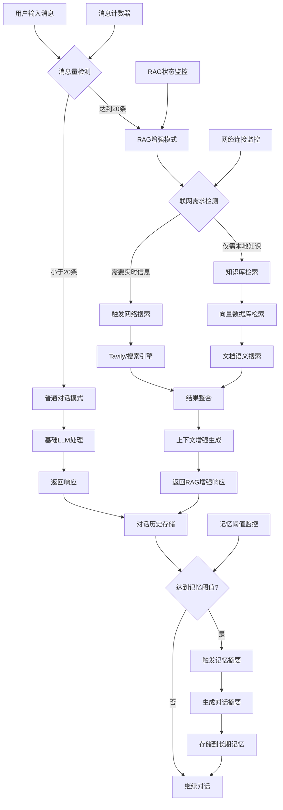

# 深度研究平台 - 后端 API 文档

## 概述

深度研究平台提供全面的 RESTful API，支持 AI 驱动的研究、文档处理和知识管理。本文档描述了所有可用的 API 端点、认证方法、请求/响应模型和使用指南。

## 目录

1. [基础 URL](#基础-url)
2. [认证](#认证)
3. [通用响应格式](#通用响应格式)
4. [错误处理](#错误处理)
5. [API 端点](#api-端点)
   - [认证](#认证端点)
   - [用户管理](#用户管理端点)
   - [健康监控](#健康监控端点)
   - [聊天对话](#聊天对话端点)
   - [研究](#研究端点)
   - [文档与 RAG](#文档与-rag-端点)
   - [文件上传](#文件上传端点)
   - [OCR](#ocr-端点)
   - [搜索](#搜索端点)
   - [证据链](#证据链端点)
   - [计费订阅](#计费订阅端点)
   - [内容审核](#内容审核端点)
   - [管理员](#管理员端点)
6. [速率限制与配额](#速率限制与配额)
7. [SDK 与集成示例](#sdk-与集成示例)

## 基础 URL

```
http://localhost:8000/api
```

## API 统计信息

- **总 API 文件数**: 32
- **总端点数**: 80+
- **认证方式**: OAuth2 配合 JWT 令牌
- **内容类型**: JSON（文件上传除外：multipart/form-data）
- **架构**: 使用标准 HTTP 方法的 RESTful 架构
- **速率限制**: 基于角色的配额
- **错误处理**: 标准化的 JSON 错误响应

## 端点类别与参数数量

### 认证 (3个端点)
- `POST /auth/register` - 3个参数 (username, email, password)
- `POST /auth/login` - 2个参数 (username, password)
- `GET /auth/me` - 0个参数 (基于令牌)

### 用户管理 (6个端点)
- `POST /user/onboarding` - 3个参数 (action, step, data)
- `GET /user/onboarding/status` - 0个参数
- `POST /user/preferences` - 1个参数 (preferences 对象)
- `GET /user/preferences` - 0个参数
- `GET /system/info` - 0个参数
- 平均: 每个端点 1.2 个参数

### 健康监控 (3个端点)
- `GET /health/` - 0个参数
- `GET /health/detailed` - 0个参数 (仅管理员)
- `GET /health/performance` - 0个参数 (仅管理员)

### 聊天对话 (9个端点)
- `GET /conversation/sessions` - 2个参数 (page, page_size)
- `POST /conversation/sessions` - 2个参数 (title, initial_message)
- `GET /conversation/sessions/{session_id}` - 1个参数 (session_id)
- `POST /conversation/sessions/{session_id}/messages` - 2个参数 (role, content) - **智能编排器入口**
- `DELETE /conversation/sessions/{session_id}` - 1个参数 (session_id)
- `GET /conversation/memory/summary` - 0个参数
- `POST /conversation/memory/trigger-summary` - 3个参数 (session_id, force, summary_type)
- `GET /conversation/memory/threshold-status` - 1个参数 (session_id)
- `POST /conversation/memory/config` - 6个参数 (memory_threshold, auto_summary_enabled, summary_type, retain_messages, compression_ratio, notification_enabled)
- 平均: 每个端点 2.0 个参数

**设计理念**: 基于 `/conversation/` 系列端点的有状态会话管理，集成智能编排器和记忆管理功能，支持动态RAG监测、联网搜索意图路由和长期记忆管理。

### 研究工作流 (3个端点)
- `POST /research` - 6个参数 (query, session_id, depth, sources, language, options)
- `GET /research/{session_id}` - 1个参数 (session_id)
- `GET /research/stream/{session_id}` - 1个参数 (session_id)
- 平均: 每个端点 2.7 个参数

### 文档与 RAG (10个端点)
- `POST /rag/upload-document` - 1个参数 (file)
- `GET /rag/document/{job_id}` - 1个参数 (job_id)
- `GET /rag/documents` - 2个参数 (page, page_size)
- `DELETE /rag/document/{job_id}` - 1个参数 (job_id)
- `POST /rag/document/{job_id}/retry` - 1个参数 (job_id)
- `GET /rag/search` - 4个参数 (query, limit, score_threshold, use_reranking)
- `GET /rag/knowledge-bases` - 0个参数
- `POST /rag/knowledge-bases` - 2个参数 (name, description)
- `DELETE /rag/knowledge-bases/{kb_name}` - 1个参数 (kb_name)
- `POST /rag/knowledge-bases/{kb_name}/upload` - 1个参数 (file)
- `POST /rag/knowledge-bases/{kb_name}/search` - 2个参数 (query, top_k)
- 平均: 每个端点 1.4 个参数

### 文件管理 (4个端点)
- `POST /files/upload` - 1个参数 (file)
- `GET /files/{file_id}/status` - 1个参数 (file_id)
- `GET /files/list` - 2个参数 (skip, limit)
- `DELETE /files/{file_id}` - 1个参数 (file_id)
- 平均: 每个端点 1.3 个参数

### OCR 服务 (3个端点)
- `POST /ocr/recognize` - 1个参数 (file)
- `GET /ocr/status` - 0个参数
- `POST /ocr/batch` - 1个参数 (files)
- 平均: 每个端点 0.7 个参数

### 搜索服务 (4个端点)
- `GET /search/providers` - 0个参数
- `POST /search/providers/set` - 1个参数 (provider)
- `POST /search/` - 4个参数 (query, provider, system_prompt, search_limit)
- `GET /search/test/{provider}` - 1个参数 (provider)
- 平均: 每个端点 1.5 个参数

### 证据链 (4个端点)
- `GET /evidence/conversation/{conversation_id}` - 3个参数 (conversation_id, limit, offset)
- `GET /evidence/research/{research_session_id}` - 3个参数 (research_session_id, limit, offset)
- `PUT /evidence/evidence/{evidence_id}/mark_used` - 2个参数 (evidence_id, used)
- `GET /evidence/stats` - 1个参数 (days)
- 平均: 每个端点 2.3 个参数

### 计费与订阅 (4个端点)
- `POST /billing/create-checkout-session` - 0个参数
- `POST /billing/create-portal-session` - 0个参数
- `GET /billing/subscription-status` - 0个参数
- `POST /billing/webhooks/stripe` - 1个参数 (Stripe 事件)
- 平均: 每个端点 0.3 个参数

### 内容审核 (6个端点)
- `POST /moderation/report` - 4个参数 (message_id, report_reason, report_description, context_data)
- `GET /moderation/my-reports` - 3个参数 (status, limit, offset)
- `GET /moderation/admin/queue` - 5个参数 (status, priority, reason, limit, offset)
- `POST /moderation/admin/{report_id}/review` - 3个参数 (report_id, action, review_notes)
- `GET /moderation/admin/stats` - 0个参数
- 平均: 每个端点 3.0 个参数

### 管理员管理 (15个端点)
- 各种端点，每个端点 0-8 个参数
- 用户管理、统计、审计日志、系统健康
- 平均: 每个端点 2.1 个参数

### 配额管理 (2个端点)
- `GET /quota/status` - 0个参数
- `GET /quota/history` - 1个参数 (limit)
- 平均: 每个端点 0.5 个参数

## 总体统计
- **所有端点参数总数**: ~250+
- **每个端点平均参数数**: 1.7
- **最复杂的端点**: `POST /moderation/admin/queue` (5个参数)
- **最简单的端点**: 多个GET端点，0个参数

## 完整API端点概览

| 类别 | 方法 | 端点 | 参数 | 需要认证 | 描述 |
|-----------|--------|----------|------------|---------------|-------------|
| **认证** | POST | `/auth/register` | 3 | 否 | 用户注册 |
| | POST | `/auth/login` | 2 | 否 | 用户登录 |
| | GET | `/auth/me` | 0 | 是 | 获取当前用户信息 |
| **用户管理** | POST | `/user/onboarding` | 3 | 是 | 用户引导流程 |
| | GET | `/user/onboarding/status` | 0 | 是 | 获取引导状态 |
| | POST | `/user/preferences` | 1 | 是 | 更新用户偏好 |
| | GET | `/user/preferences` | 0 | 是 | 获取用户偏好 |
| | GET | `/system/info` | 0 | 否 | 获取系统信息 |
| **健康监控** | GET | `/health/` | 0 | 否 | 基本健康检查 |
| | GET | `/health/detailed` | 0 | 是 | 详细健康状态(管理员) |
| | GET | `/health/performance` | 0 | 是 | 性能指标(管理员) |
| **聊天对话** | GET | `/conversation/sessions` | 2 | 是 | 列出对话会话 |
| | POST | `/conversation/sessions` | 2 | 是 | 创建对话 |
| | GET | `/conversation/sessions/{id}` | 1 | 是 | 获取对话详情 |
| | POST | `/conversation/sessions/{id}/messages` | 2 | 是 | 智能编排器聊天 |
| | DELETE | `/conversation/sessions/{id}` | 1 | 是 | 删除对话 |
| | GET | `/conversation/memory/summary` | 0 | 是 | 对话记忆摘要 |
| | POST | `/conversation/memory/trigger-summary` | 3 | 是 | 触发记忆摘要 |
| | GET | `/conversation/memory/threshold-status` | 1 | 是 | 获取记忆阈值状态 |
| | POST | `/conversation/memory/config` | 6 | 是 | 配置记忆阈值参数 |
| **研究工作流** | POST | `/research` | 6 | 是 | 开始研究工作流 |
| | GET | `/research/{session_id}` | 1 | 否 | 获取研究报告 |
| | GET | `/research/stream/{session_id}` | 1 | 否 | 流式研究进度 |
| **文档与RAG** | POST | `/rag/upload-document` | 1 | 是 | 上传文档 |
| | GET | `/rag/document/{job_id}` | 1 | 是 | 获取文档状态 |
| | GET | `/rag/documents` | 2 | 是 | 列出用户文档 |
| | DELETE | `/rag/document/{job_id}` | 1 | 是 | 删除文档 |
| | POST | `/rag/document/{job_id}/retry` | 1 | 是 | 重试文档处理 |
| | GET | `/rag/search` | 4 | 是 | 搜索文档 |
| | GET | `/rag/knowledge-bases` | 0 | 是 | 列出知识库 |
| | POST | `/rag/knowledge-bases` | 2 | 是 | 创建知识库 |
| | DELETE | `/rag/knowledge-bases/{name}` | 1 | 是 | 删除知识库 |
| | POST | `/rag/knowledge-bases/{name}/upload` | 1 | 是 | 上传到知识库 |
| | POST | `/rag/knowledge-bases/{name}/search` | 2 | 是 | 搜索知识库 |
| **文件管理** | POST | `/files/upload` | 1 | 是 | 上传文件 |
| | GET | `/files/{file_id}/status` | 1 | 是 | 获取文件状态 |
| | GET | `/files/list` | 2 | 是 | 列出用户文件 |
| | DELETE | `/files/{file_id}` | 1 | 是 | 删除文件 |
| **OCR服务** | POST | `/ocr/recognize` | 1 | 是 | OCR识别 |
| | GET | `/ocr/status` | 0 | 是 | OCR服务状态 |
| | POST | `/ocr/batch` | 1 | 是 | 批量OCR处理 |
| **搜索服务** | GET | `/search/providers` | 0 | 是 | 获取搜索提供商 |
| | POST | `/search/providers/set` | 1 | 是 | 设置搜索提供商 |
| | POST | `/search/` | 4 | 是 | 网络搜索 |
| | GET | `/search/test/{provider}` | 1 | 是 | 测试搜索提供商 |
| **证据链** | GET | `/evidence/conversation/{id}` | 3 | 是 | 获取对话证据 |
| | GET | `/evidence/research/{session_id}` | 3 | 是 | 获取研究证据 |
| | PUT | `/evidence/evidence/{id}/mark_used` | 2 | 是 | 标记证据已使用 |
| | GET | `/evidence/stats` | 1 | 是 | 获取证据统计 |
| **计费订阅** | POST | `/billing/create-checkout-session` | 0 | 是 | 创建结账会话 |
| | POST | `/billing/create-portal-session` | 0 | 是 | 创建门户会话 |
| | GET | `/billing/subscription-status` | 0 | 是 | 获取订阅状态 |
| | POST | `/billing/webhooks/stripe` | 1 | 否 | Stripe网络钩子处理 |
| **内容审核** | POST | `/moderation/report` | 4 | 是 | 举报内容 |
| | GET | `/moderation/my-reports` | 3 | 是 | 获取我的举报 |
| | GET | `/moderation/admin/queue` | 5 | 是 | 获取审核队列(管理员) |
| | POST | `/moderation/admin/{id}/review` | 3 | 是 | 审核举报(管理员) |
| | GET | `/moderation/admin/stats` | 0 | 是 | 获取审核统计(管理员) |
| **配额管理** | GET | `/quota/status` | 0 | 是 | 获取配额状态 |
| | GET | `/quota/history` | 1 | 是 | 获取使用历史 |
| **管理员** | GET | `/admin/users` | 5 | 是 | 列出用户(管理员) |
| | GET | `/admin/users/{user_id}` | 1 | 是 | 获取用户详情(管理员) |
| | PATCH | `/admin/users/{user_id}` | 2 | 是 | 更新用户(管理员) |
| | POST | `/admin/users/{user_id}/toggle-active` | 1 | 是 | 切换用户激活状态(管理员) |
| | GET | `/admin/stats/users` | 0 | 是 | 获取用户统计(管理员) |
| | GET | `/admin/users/{user_id}/conversations` | 2 | 是 | 获取用户对话(管理员) |
| | GET | `/admin/users/{user_id}/api-usage` | 2 | 是 | 获取用户API使用(管理员) |
| | GET | `/admin/users/{user_id}/documents` | 2 | 是 | 获取用户文档(管理员) |
| | GET | `/admin/research-reports` | 2 | 是 | 获取所有研究报告(管理员) |
| | GET | `/admin/research-reports/{doc_id}` | 1 | 是 | 获取研究报告详情(管理员) |
| | GET | `/admin/subscriptions` | 3 | 是 | 获取所有订阅(管理员) |
| | PATCH | `/admin/subscriptions/{sub_id}` | 1 | 是 | 更新订阅(管理员) |
| | GET | `/admin/audit-logs` | 7 | 是 | 获取审计日志(管理员) |
| | GET | `/admin/audit-logs/summary` | 0 | 是 | 获取审计日志摘要(管理员) |
| | GET | `/admin/health` | 0 | 是 | 系统健康检查(管理员) |
| | POST | `/admin/llm/debug` | 5 | 是 | LLM调试和参数调优(管理员) |

## 关键统计摘要

- **总端点数**: 84个端点 (+3)
- **需要认证的端点**: 75个 (89%)
- **仅管理员端点**: 18个
- **文件上传端点**: 4个
- **流式端点**: 2个 (研究进度 + 智能编排器)
- **网络钩子端点**: 1个 (Stripe)
- **平均参数数**: 每个端点 1.8 个参数
- **参数最丰富的类别**: 记忆管理 (平均 3.3 个参数)
- **最简单的类别**: 计费 (平均 0.3 个参数)

**架构优化**:
- 聊天对话端点从6个扩展到9个，增加记忆管理功能
- 新增智能编排器功能，支持动态RAG、联网搜索和记忆管理
- 移除冗余的 `/chat` 和 `/llm/chat` 端点
- 新增管理员调试端点 `/admin/llm/debug`
- 新增3个记忆管理端点，支持长期记忆和阈值管理

## 智能聊天系统流程图



## 功能概览

### 核心能力
- **智能编排器**: 意图路由、动态RAG监测和联网搜索的统一对话系统
- **多智能体研究**: 使用多个AI智能体的自动化研究工作流
- **文档处理**: 支持OCR的PDF、DOCX、TXT、MD文件处理
- **语义搜索**: 高级RAG(检索增强生成)搜索，支持会话级知识库
- **有状态聊天**: 基于会话管理的流式对话，支持长上下文
- **知识库**: 个人知识库创建和管理
- **内容审核**: 用户举报内容审核系统
- **计费集成**: 基于Stripe的订阅管理
- **管理员仪表板**: 全面的用户和系统管理，包含LLM调试功能

### 智能对话流程特性
- **动态RAG监测**: 自动检测会话何时需要构建知识库 (20条消息阈值)
- **记忆阈值管理**: 自动检测会话何时需要生成摘要 (默认50条消息)
- **意图路由**: 智能区分联网搜索、RAG查询和常规对话
- **长期记忆管理**: 异步摘要生成和存储，支持无限对话扩展
- **流式响应**: Server-Sent Events提供实时状态反馈
- **会话持久化**: 可靠的消息存储和状态管理
- **监控系统**: 完整的消息计数器、RAG状态监控、网络连接监控和记忆阈值监控
- **管理员调试**: 专门的调试接口支持参数调优和系统诊断

### 记忆管理系统
- **阈值检测**: 自动监控消息数量，触发摘要生成
- **异步摘要**: 后台生成对话摘要，不影响用户体验
- **智能压缩**: 保留关键信息，压缩历史对话
- **长期存储**: 摘要信息存储到长期记忆，支持快速检索
- **用户配置**: 可自定义记忆阈值、摘要类型和保留策略

### 支持的文件格式
- **文档**: PDF, DOCX, DOC, TXT, MD, RTF
- **图像**: JPG, JPEG, PNG, BMP, TIFF (用于OCR)
- **演示文稿**: PPT, PPTX
- **数据**: JSON, CSV

## 认证

### OAuth2 密码流

平台使用 OAuth2 配合 JWT 令牌进行认证。

**令牌端点:** `POST /api/auth/login`

**授权头部:**
```
Authorization: Bearer <jwt_token>
```

### 令牌类型

- **访问令牌**: 用于API访问的JWT令牌
- **令牌类型**: "bearer"
- **过期时间**: 可配置 (默认24小时)

### 必需认证

大多数端点需要认证。受保护的端点在文档中用 🔒 标记。

## 通用响应格式

### 成功响应
```json
{
  "error": false,
  "message": "操作成功",
  "data": { ... },
  "request_id": "optional_request_id"
}
```

### 错误响应
```json
{
  "error": true,
  "code": "ERROR_CODE",
  "message": "人类可读的错误消息",
  "details": { ... },
  "request_id": "optional_request_id"
}
```

### 分页响应
```json
{
  "data": [...],
  "total": 150,
  "page": 1,
  "page_size": 20,
  "has_next": true,
  "has_prev": false
}
```

## 错误处理

### HTTP 状态码

| 代码 | 描述 | 示例场景 |
|------|-------------|------------------|
| 200 | 成功 | 请求成功完成 |
| 201 | 已创建 | 资源成功创建 |
| 400 | 错误请求 | 无效输入数据，验证错误 |
| 401 | 未授权 | 缺少或无效认证令牌 |
| 403 | 禁止访问 | 权限不足 |
| 404 | 未找到 | 资源不存在 |
| 409 | 冲突 | 资源已存在或操作冲突 |
| 413 | 载荷过大 | 文件大小超出限制 |
| 429 | 请求过多 | 超出速率限制 |
| 500 | 内部服务器错误 | 服务器端错误 |
| 503 | 服务不可用 | 服务暂时不可用 |

### 错误代码

| 代码 | 描述 |
|------|-------------|
| `VALIDATION_ERROR` | 输入验证失败 |
| `UNAUTHORIZED` | 需要认证 |
| `FORBIDDEN` | 权限不足 |
| `NOT_FOUND` | 资源未找到 |
| `RATE_LIMITED` | 超出速率限制 |
| `QUOTA_EXCEEDED` | 超出用户配额 |
| `FILE_UPLOAD_ERROR` | 文件上传失败 |
| `DATABASE_ERROR` | 数据库操作失败 |
| `BUSINESS_LOGIC_ERROR` | 业务规则违反 |

## API 端点

### 认证端点

#### 用户注册
```http
POST /api/auth/register
```

**请求体:**
```json
{
  "username": "string",
  "email": "string",
  "password": "string"
}
```

**响应 (201):**
```json
{
  "access_token": "jwt_token",
  "token_type": "bearer",
  "user_id": 123,
  "username": "john_doe",
  "email": "john@example.com",
  "role": "free"
}
```

**验证规则:**
- `username`: 3-30个字符，字母数字 + 下划线
- `email`: 有效的邮箱格式
- `password`: 最少8个字符，必须包含大写字母、小写字母和数字

#### 登录
```http
POST /api/auth/login
```

**请求体 (表单数据):**
```
username: string
password: string
```

**响应 (200):**
```json
{
  "access_token": "jwt_token",
  "token_type": "bearer"
}
```

#### 获取当前用户
```http
GET /api/auth/me
Authorization: Bearer <token>
```

**响应 (200):**
```json
{
  "id": 123,
  "username": "john_doe",
  "email": "john@example.com",
  "role": "subscribed"
}
```

### 用户管理端点

#### 用户引导
```http
POST /api/user/onboarding
Authorization: Bearer <token>
```

**请求体:**
```json
{
  "action": "start|complete|skip",
  "step": "optional_step_name",
  "data": { "key": "value" }
}
```

**响应 (200):**
```json
{
  "success": true,
  "message": "引导步骤已完成",
  "next_step": "preferences_setup",
  "progress": { "completed": 2, "total": 5 }
}
```

#### 获取用户偏好
```http
GET /api/user/preferences
Authorization: Bearer <token>
```

**响应 (200):**
```json
{
  "theme": "dark",
  "language": "en",
  "notifications": {
    "email": true,
    "push": false
  },
  "research_settings": {
    "default_depth": "medium",
    "auto_citations": true
  }
}
```

#### 更新用户偏好
```http
POST /api/user/preferences
Authorization: Bearer <token>
```

**请求体:**
```json
{
  "preferences": {
    "theme": "light",
    "language": "zh",
    "notifications": {
      "email": false,
      "push": true
    }
  }
}
```

#### 获取系统信息
```http
GET /api/system/info
```

**响应 (200):**
```json
{
  "platform_name": "深度研究平台",
  "version": "1.0.0",
  "features": [
    "multi_agent_research",
    "document_processing",
    "semantic_search",
    "real_time_chat"
  ],
  "limits": {
    "free_users": {
      "max_documents": 10,
      "max_research_per_day": 3
    },
    "subscribed_users": {
      "max_documents": 1000,
      "max_research_per_day": 50
    }
  }
}
```

### 健康监控端点

#### 基本健康检查
```http
GET /api/health/
```

**响应 (200):**
```json
{
  "status": "healthy",
  "timestamp": "2024-01-15T10:30:00Z",
  "version": "1.0.0",
  "uptime": 86400,
  "components": {
    "database": "healthy",
    "redis": "healthy",
    "llm_providers": {
      "openai": "healthy",
      "anthropic": "healthy",
      "doubao": "degraded"
    },
    "memory_management": "healthy",
    "search_providers": "healthy"
  }
}
```

#### 详细健康检查 🔒
```http
GET /api/health/detailed
Authorization: Bearer <token>
```

**Requirements:** Admin role

**Response (200):**
```json
{
  "status": "healthy",
  "database_stats": {
    "documents": 15420,
    "chunks": 487320,
    "embeddings": 487320,
    "evidence_records": 8934,
    "conversations": 2540,
    "messages": 45680,
    "memory_summaries": 320
  },
  "queue_stats": {
    "pending_tasks": 12,
    "processing_tasks": 3,
    "failed_tasks": 0,
    "memory_tasks": 2
  },
  "routing_stats": {
    "total_requests": 12543,
    "avg_response_time": 1.2,
    "success_rate": 98.7
  },
  "memory_management": {
    "status": "healthy",
    "active_conversations": 1250,
    "threshold_monitoring": "active",
    "summary_queue_size": 2,
    "avg_summary_time": 15.5,
    "memory_efficiency": 94.2
  },
  "monitoring_systems": {
    "message_counter": "active",
    "rag_status_monitor": "active",
    "network_connection_monitor": "active",
    "memory_threshold_monitor": "active"
  }
}
```

#### Performance Metrics 🔒
```http
GET /api/health/performance
Authorization: Bearer <token>
```

**Requirements:** Admin role

**Response (200):**
```json
{
  "system_metrics": {
    "cpu_usage": 45.2,
    "memory_usage": 68.7,
    "disk_usage": 23.1
  },
  "api_metrics": {
    "requests_per_minute": 120,
    "avg_response_time": 850,
    "error_rate": 1.2
  },
  "database_metrics": {
    "connection_pool": {
      "active": 15,
      "idle": 25,
      "total": 40
    },
    "query_performance": {
      "avg_query_time": 45,
      "slow_queries": 2
    }
  }
}
```

### 聊天对话端点

#### 智能编排器聊天 🔒
```http
POST /api/conversation/sessions/{session_id}/messages
Authorization: Bearer <token>
```

**核心功能**: 这是平台的主要聊天入口，集成了智能编排器功能，支持：
- 意图分析和路由 (常规对话/联网搜索/RAG查询)
- 动态RAG监测 (异步构建会话知识库)
- 流式响应处理
- 会话状态持久化

**请求体:**
```json
{
  "role": "user|assistant|system",
  "content": "string"
}
```

**智能编排流程:**
1. **会话加载**: 从数据库加载历史对话和元数据
2. **动态RAG监测**: 检查是否需要构建会话RAG (消息数>20且rag_ready=false)
3. **记忆阈值检测**: 检查消息数是否达到记忆阈值 (默认50条)
4. **意图路由**: 分析用户消息意图
   - 联网意图 → 调用 `/search/` 端点
   - RAG意图 → 调用 `/rag/search` 端点
   - 常规对话 → 直接调用LLM
5. **上下文增强**: 根据意图组合历史+增强信息
6. **LLM调用**: 生成流式回复
7. **持久化**: 保存用户消息和AI回复
8. **记忆管理**:
   - 检查是否触发记忆摘要 (异步)
   - 如需要，生成对话摘要并存储到长期记忆

**响应 (200) - 流式:**
```
data: {"type": "thinking", "message": "正在分析意图..."}
data: {"type": "routing", "intent": "web_search"}
data: {"type": "content", "content": "根据最新信息..."}
data: {"type": "complete", "message_id": "msg_123"}
```

**响应特性:**
- Server-Sent Events (SSE) 流式传输
- 实时意图分析和处理状态反馈
- 自动会话状态管理
- 支持长上下文和动态知识检索

#### Get Conversation Sessions 🔒
```http
GET /api/conversation/sessions?page=1&page_size=20
Authorization: Bearer <token>
```

**Response (200):**
```json
[
  {
    "id": "session_123",
    "title": "Quantum Computing Research",
    "user_id": "user_456",
    "created_at": "2024-01-15T10:00:00Z",
    "updated_at": "2024-01-15T11:30:00Z",
    "message_count": 15,
    "last_message": "Thank you for the explanation!"
  }
]
```

#### Create Conversation Session 🔒
```http
POST /api/conversation/sessions
Authorization: Bearer <token>
```

**Request Body:**
```json
{
  "title": "New Research Topic",
  "initial_message": "I want to learn about artificial intelligence"
}
```

**Response (201):**
```json
{
  "id": "session_789",
  "title": "New Research Topic",
  "user_id": "user_456",
  "created_at": "2024-01-15T12:00:00Z",
  "updated_at": "2024-01-15T12:00:00Z",
  "message_count": 1,
  "last_message": "I want to learn about artificial intelligence",
  "memory_status": {
    "threshold_count": 50,
    "current_count": 1,
    "threshold_status": "active",
    "last_summary_at": null,
    "summary_count": 0,
    "auto_summary_enabled": true,
    "rag_ready": false
  }
}
```

#### Get Conversation Detail 🔒
```http
GET /api/conversation/sessions/{session_id}
Authorization: Bearer <token>
```

**Response (200):**
```json
{
  "id": "session_123",
  "title": "Quantum Computing Research",
  "user_id": "user_456",
  "created_at": "2024-01-15T10:00:00Z",
  "updated_at": "2024-01-15T11:30:00Z",
  "message_count": 15,
  "memory_status": {
    "threshold_count": 50,
    "current_count": 15,
    "threshold_status": "active",
    "last_summary_at": null,
    "summary_count": 0,
    "auto_summary_enabled": true,
    "rag_ready": false
  },
  "messages": [
    {
      "id": "msg_001",
      "role": "user",
      "content": "What is quantum computing?",
      "timestamp": "2024-01-15T10:00:00Z"
    },
    {
      "id": "msg_002",
      "role": "assistant",
      "content": "Quantum computing is a revolutionary computing paradigm...",
      "timestamp": "2024-01-15T10:01:00Z"
    }
  ]
}
```

#### Add Message to Conversation 🔒
```http
POST /api/conversation/sessions/{session_id}/messages
Authorization: Bearer <token>
```

**Request Body:**
```json
{
  "role": "user|assistant|system",
  "content": "Can you explain more about qubits?"
}
```

**Response (200):**
```json
{
  "message": "Message added successfully",
  "session_id": "session_123",
  "message_id": "msg_456"
}
```

#### Get Conversation Memory Summary 🔒
```http
GET /api/conversation/memory/summary
Authorization: Bearer <token>
```

**Response (200):**
```json
{
  "user_id": "user_456",
  "total_conversations": 25,
  "total_messages": 340,
  "favorite_topics": [
    "quantum computing",
    "artificial intelligence",
    "machine learning"
  ],
  "conversation_style": "professional and detailed",
  "last_active": "2024-01-15T11:30:00Z"
}
```

#### 触发记忆摘要 🔒
```http
POST /api/conversation/memory/trigger-summary
Authorization: Bearer <token>
```

**功能**: 手动触发指定会话的记忆摘要生成，用于长期记忆管理。

**请求体:**
```json
{
  "session_id": "session_123",
  "force": false,
  "summary_type": "auto|detailed|key_points"
}
```

**请求参数:**
- `session_id`: 目标会话ID
- `force`: 是否强制重新生成摘要 (即使已存在)
- `summary_type`: 摘要类型 (auto=自动选择, detailed=详细摘要, key_points=关键点)

**响应 (200):**
```json
{
  "task_id": "memory_task_456",
  "session_id": "session_123",
  "status": "processing",
  "message": "记忆摘要生成任务已启动",
  "estimated_time": 30
}
```

#### 获取记忆阈值状态 🔒
```http
GET /api/conversation/memory/threshold-status?session_id=session_123
Authorization: Bearer <token>
```

**功能**: 获取指定会话的记忆阈值状态和统计信息。

**响应 (200):**
```json
{
  "session_id": "session_123",
  "current_message_count": 45,
  "memory_threshold": 50,
  "threshold_status": "approaching",
  "threshold_percentage": 90,
  "last_summary_at": "2024-01-10T10:00:00Z",
  "summary_count": 2,
  "memory_status": "active",
  "next_summary_estimate": "5条消息后",
  "auto_summary_enabled": true
}
```

#### 配置记忆阈值参数 🔒
```http
POST /api/conversation/memory/config
Authorization: Bearer <token>
```

**功能**: 配置用户的记忆管理参数和阈值设置。

**请求体:**
```json
{
  "memory_threshold": 50,
  "auto_summary_enabled": true,
  "summary_type": "auto",
  "retain_messages": 10,
  "compression_ratio": 0.3,
  "notification_enabled": true
}
```

**请求参数:**
- `memory_threshold`: 触发摘要的消息数量阈值 (默认50)
- `auto_summary_enabled`: 是否启用自动摘要 (默认true)
- `summary_type`: 默认摘要类型
- `retain_messages`: 摘要后保留的最新消息数量
- `compression_ratio`: 摘要压缩比例 (0.1-0.5)
- `notification_enabled`: 是否在摘要时通知用户

**响应 (200):**
```json
{
  "success": true,
  "message": "记忆管理配置已更新",
  "config": {
    "memory_threshold": 50,
    "auto_summary_enabled": true,
    "summary_type": "auto",
    "retain_messages": 10,
    "compression_ratio": 0.3,
    "notification_enabled": true,
    "updated_at": "2024-01-15T12:00:00Z"
  }
}
```

### Research Endpoints

#### Start Research 🔒
```http
POST /api/research
Authorization: Bearer <token>
```

**Request Body:**
```json
{
  "query": "The impact of artificial intelligence on healthcare",
  "session_id": "optional_session_id",
  "depth": "basic|intermediate|comprehensive",
  "sources": ["academic", "news", "technical"],
  "language": "en|zh|es"
}
```

**Response (200):**
```json
{
  "session_id": "research_789",
  "status": "completed|failed|error",
  "documents_found": 45,
  "iterations": 3,
  "error": null
}
```

#### Get Research Report
```http
GET /api/research/{session_id}
```

**Response (200):**
```markdown
# Research Report: The Impact of AI on Healthcare

## Executive Summary
Artificial intelligence is revolutionizing healthcare through...

## Key Findings
1. **Diagnostic Accuracy**: AI algorithms have shown...
2. **Drug Discovery**: Machine learning models accelerate...
3. **Personalized Medicine**: AI enables...

## Sources
- [1] Smith et al. (2023). "AI in Medical Imaging..."
- [2] Johnson & Lee (2024). "Machine Learning for Drug Discovery..."
```

#### Stream Research Progress
```http
GET /api/research/stream/{session_id}
```

**Response (Server-Sent Events):**
```
data: {"phase":"planning","message":"Generating research plan..."}

data: {"phase":"collecting","message":"Retrieving and collecting sources..."}

data: {"phase":"synthesizing","message":"Writing report..."}

data: {"status":"completed"}
```

### Document & RAG Endpoints

#### Upload Document for RAG 🔒
```http
POST /api/rag/upload-document
Authorization: Bearer <token>
Content-Type: multipart/form-data
```

**Form Data:**
- `file`: Document file (PDF, DOCX, TXT, MD)

**Response (201):**
```json
{
  "job_id": "job_123",
  "status": "pending",
  "message": "Document uploaded successfully, processing in background"
}
```

**File Limits:**
- Maximum file size: 50MB
- Supported formats: .pdf, .docx, .doc, .txt, .md

#### Get Document Status 🔒
```http
GET /api/rag/document/{job_id}
Authorization: Bearer <token>
```

**Response (200):**
```json
{
  "job_id": "job_123",
  "status": "completed|processing|failed",
  "filename": "research_paper.pdf",
  "created_at": "2024-01-15T10:00:00Z",
  "started_at": "2024-01-15T10:01:00Z",
  "completed_at": "2024-01-15T10:05:00Z",
  "error_message": null,
  "result": {
    "chunks_created": 25,
    "embeddings_generated": 25,
    "extracted_text_length": 15000
  }
}
```

#### List User Documents 🔒
```http
GET /api/rag/documents?page=1&page_size=20
Authorization: Bearer <token>
```

**Response (200):**
```json
{
  "documents": [
    {
      "job_id": "job_123",
      "filename": "research_paper.pdf",
      "status": "completed",
      "created_at": "2024-01-15T10:00:00Z",
      "progress": 100,
      "error_message": null
    }
  ],
  "total": 15
}
```

#### Delete Document 🔒
```http
DELETE /api/rag/document/{job_id}
Authorization: Bearer <token>
```

**Response (200):**
```json
{
  "message": "Document deleted successfully"
}
```

#### Retry Document Processing 🔒
```http
POST /api/rag/document/{job_id}/retry
Authorization: Bearer <token>
```

**Response (200):**
```json
{
  "message": "Document reprocessing started"
}
```

#### Search Documents 🔒
```http
GET /api/rag/search?query=artificial intelligence&limit=10&score_threshold=0.5&use_reranking=true
Authorization: Bearer <token>
```

**Query Parameters:**
- `query`: Search query (required)
- `limit`: Maximum results (default: 10, max: 50)
- `score_threshold`: Minimum relevance score (default: 0.0)
- `use_reranking`: Enable two-stage reranking (default: true)

**Response (200):**
```json
{
  "query": "artificial intelligence",
  "results": [
    {
      "chunk_id": "chunk_123",
      "document_id": "doc_456",
      "content": "Artificial intelligence is transforming healthcare by...",
      "score": 0.89,
      "recall_score": 0.75,
      "rerank_score": 0.92,
      "source_url": "https://example.com/paper.pdf",
      "filename": "healthcare_ai_research.pdf",
      "snippet": "Artificial intelligence is transforming healthcare by...",
      "citation_id": "cite_789",
      "metadata": {
        "page": 15,
        "section": "Introduction"
      }
    }
  ],
  "total": 8,
  "search_method": "two_stage_reranking",
  "message": "Two-stage retrieval completed (recalled 50 candidates, reranked to 8)"
}
```

#### Knowledge Base Management 🔒

##### List Knowledge Bases
```http
GET /api/rag/knowledge-bases
Authorization: Bearer <token>
```

**Response (200):**
```json
{
  "knowledge_bases": [
    {
      "name": "medical_research",
      "description": "Medical research papers and articles",
      "created_at": "2024-01-10T10:00:00Z",
      "file_count": 25
    }
  ],
  "total": 1
}
```

##### Create Knowledge Base
```http
POST /api/rag/knowledge-bases
Authorization: Bearer <token>
```

**Request Body:**
```json
{
  "name": "ai_research",
  "description": "AI research papers and documentation"
}
```

**Validation:**
- Name: 3-20 characters, alphanumeric only
- Maximum 10 knowledge bases per user

##### Delete Knowledge Base
```http
DELETE /api/rag/knowledge-bases/{kb_name}
Authorization: Bearer <token>
```

##### Upload File to Knowledge Base
```http
POST /api/rag/knowledge-bases/{kb_name}/upload
Authorization: Bearer <token>
Content-Type: multipart/form-data
```

**Form Data:**
- `file`: Document file

##### Search Knowledge Base
```http
POST /api/rag/knowledge-bases/{kb_name}/search
Authorization: Bearer <token>
```

**Request Body:**
```json
{
  "query": "machine learning algorithms",
  "top_k": 5
}
```

### File Upload Endpoints

#### Upload File 🔒
```http
POST /api/files/upload
Authorization: Bearer <token>
Content-Type: multipart/form-data
```

**Form Data:**
- `file`: File to upload

**Supported Formats:**
- PDF, PPT, PPTX, DOC, DOCX, TXT, MD

**Response (201):**
```json
{
  "file_id": "file_123",
  "filename": "document.pdf",
  "file_path": "/uploads/user_456/file_123.pdf",
  "file_size": 2048576,
  "file_type": ".pdf",
  "status": "pending",
  "message": "File uploaded successfully, processing in background"
}
```

#### Get File Status 🔒
```http
GET /api/files/{file_id}/status
Authorization: Bearer <token>
```

**Response (200):**
```json
{
  "file_id": "file_123",
  "status": "completed",
  "extracted_text": "Extracted text content from the document...",
  "error": null
}
```

#### List User Files 🔒
```http
GET /api/files/list?skip=0&limit=50
Authorization: Bearer <token>
```

**Response (200):**
```json
{
  "total": 15,
  "files": [
    {
      "file_id": "file_123",
      "filename": "research_paper.pdf",
      "status": "completed",
      "created_at": "2024-01-15T10:00:00Z",
      "updated_at": "2024-01-15T10:05:00Z",
      "progress": 100,
      "error_message": null
    }
  ]
}
```

#### Delete File 🔒
```http
DELETE /api/files/{file_id}
Authorization: Bearer <token>
```

**Response (200):**
```json
{
  "success": true,
  "message": "File deleted successfully"
}
```

### OCR Endpoints

#### Recognize Document 🔒
```http
POST /api/ocr/recognize
Authorization: Bearer <token>
Content-Type: multipart/form-data
```

**Form Data:**
- `file`: Document file (PDF, PPT, PPTX, DOC, DOCX, JPG, PNG)

**Response (200):**
```json
{
  "success": true,
  "text": "Extracted text content from the document...",
  "file_type": ".pdf",
  "pages": 15,
  "error": null
}
```

#### Get OCR Status 🔒
```http
GET /api/ocr/status
Authorization: Bearer <token>
```

**Response (200):**
```json
{
  "available": true,
  "provider": "doubao",
  "model": "ocr-general-v1.0",
  "supported_formats": [".pdf", ".ppt", ".pptx", ".doc", ".docx", ".jpg", ".jpeg", ".png", ".bmp"]
}
```

#### Batch Recognize 🔒
```http
POST /api/ocr/batch
Authorization: Bearer <token>
Content-Type: multipart/form-data
```

**Form Data:**
- `files`: Multiple document files

**Response (200):**
```json
{
  "success": true,
  "total": 3,
  "results": [
    {
      "filename": "document1.pdf",
      "success": true,
      "text": "Extracted text from document 1...",
      "error": null
    },
    {
      "filename": "document2.jpg",
      "success": false,
      "text": "",
      "error": "Unsupported image format"
    }
  ]
}
```

### Search Endpoints

#### Get Search Providers 🔒
```http
GET /api/search/providers
Authorization: Bearer <token>
```

**Response (200):**
```json
{
  "current_provider": "doubao",
  "available_providers": {
    "doubao": {
      "name": "Doubao Search",
      "description": "ByteDance's search engine",
      "status": "available"
    },
    "kimi": {
      "name": "Kimi Search",
      "description": "Moonshot AI's search engine",
      "status": "available"
    }
  }
}
```

#### Set Search Provider 🔒
```http
POST /api/search/providers/set
Authorization: Bearer <token>
```

**Request Body:**
```json
{
  "provider": "doubao|kimi"
}
```

**Response (200):**
```json
{
  "success": true,
  "message": "Search provider switched to: doubao",
  "current_provider": "doubao"
}
```

#### Web Search 🔒
```http
POST /api/search/
Authorization: Bearer <token>
```

**Request Body:**
```json
{
  "query": "latest developments in quantum computing",
  "provider": "doubao|kimi|null",
  "system_prompt": "Focus on academic and technical sources",
  "search_limit": 10
}
```

**Response (200):**
```json
{
  "success": true,
  "query": "latest developments in quantum computing",
  "answer": "Recent developments in quantum computing include breakthroughs in...",
  "search_results": [
    {
      "title": "Quantum Computing Breakthrough 2024",
      "url": "https://example.com/quantum-breakthrough",
      "snippet": "Scientists achieve new milestone in quantum computing...",
      "relevance_score": 0.95
    }
  ],
  "sources": [
    {
      "title": "Nature Quantum Information",
      "url": "https://nature.com/quantum",
      "type": "academic_journal"
    }
  ],
  "provider": "doubao",
  "error": null
}
```

#### Test Search Provider 🔒
```http
GET /api/search/test/{provider}
Authorization: Bearer <token>
```

**Response (200):**
```json
{
  "provider": "doubao",
  "status": "available",
  "response_time": 1.2,
  "test_query": "quantum computing",
  "test_results": {
    "success": true,
    "result_count": 10
  }
}
```

### Evidence Chain Endpoints

#### Get Conversation Evidence 🔒
```http
GET /api/evidence/conversation/{conversation_id}?limit=50&offset=0
Authorization: Bearer <token>
```

**Response (200):**
```json
{
  "conversation_id": "conv_123",
  "research_session_id": null,
  "total_evidence": 15,
  "evidence_by_type": {
    "academic_paper": 8,
    "news_article": 4,
    "technical_document": 3
  },
  "evidence_list": [
    {
      "id": 123,
      "source_type": "academic_paper",
      "source_url": "https://arxiv.org/abs/2024.01234",
      "source_title": "Quantum Computing: A Comprehensive Survey",
      "content": "Quantum computing represents a fundamental shift...",
      "snippet": "Quantum computing represents a fundamental shift in computation...",
      "relevance_score": 0.92,
      "confidence_score": 0.88,
      "citation_text": "Smith et al. (2024). Quantum Computing: A Comprehensive Survey.",
      "used_in_response": true,
      "metadata": {
        "authors": ["John Smith", "Jane Doe"],
        "journal": "Nature Quantum Information",
        "year": 2024
      },
      "created_at": "2024-01-15T10:30:00Z"
    }
  ]
}
```

#### Get Research Evidence 🔒
```http
GET /api/evidence/research/{research_session_id}?limit=50&offset=0
Authorization: Bearer <token>
```

**Response (200):**
```json
{
  "conversation_id": null,
  "research_session_id": "research_456",
  "total_evidence": 25,
  "evidence_by_type": {
    "academic_paper": 15,
    "news_article": 6,
    "technical_document": 4
  },
  "evidence_list": [...]
}
```

#### Mark Evidence Used 🔒
```http
PUT /api/evidence/evidence/{evidence_id}/mark_used?used=true
Authorization: Bearer <token>
```

**Response (200):**
```json
{
  "message": "Evidence usage status updated to: true"
}
```

#### Get Evidence Statistics 🔒
```http
GET /api/evidence/stats?days=7
Authorization: Bearer <token>
```

**Response (200):**
```json
{
  "period_days": 7,
  "total_evidence": 150,
  "used_evidence": 120,
  "usage_rate": 80.0,
  "avg_relevance_score": 0.85,
  "evidence_by_type": {
    "academic_paper": 80,
    "news_article": 40,
    "technical_document": 30
  }
}
```

### Billing & Subscription Endpoints

#### Create Checkout Session 🔒
```http
POST /api/billing/create-checkout-session
Authorization: Bearer <token>
```

**Response (200):**
```json
{
  "url": "https://checkout.stripe.com/pay/cs_test_123456"
}
```

#### Create Customer Portal Session 🔒
```http
POST /api/billing/create-portal-session
Authorization: Bearer <token>
```

**Response (200):**
```json
{
  "url": "https://billing.stripe.com/session/bps_123456"
}
```

#### Get Subscription Status 🔒
```http
GET /api/billing/subscription-status
Authorization: Bearer <token>
```

**Response (200):**
```json
{
  "has_active_subscription": true,
  "subscription_id": "sub_123456",
  "status": "active",
  "current_period_end": "2024-02-15T10:00:00Z",
  "plan_name": "Deep Research Pro"
}
```

#### Stripe Webhook
```http
POST /api/billing/webhooks/stripe
Stripe-Signature: <signature>
```

**Handled Events:**
- `checkout.session.completed`
- `customer.subscription.updated`
- `customer.subscription.deleted`
- `invoice.payment_failed`
- `invoice.payment_succeeded`

**Response (200):**
```json
{
  "status": "success"
}
```

### Moderation Endpoints

#### Report Content 🔒
```http
POST /api/moderation/report
Authorization: Bearer <token>
```

**Request Body:**
```json
{
  "message_id": "msg_123456",
  "report_reason": "spam|harassment|violence|inappropriate_content|misinformation|other",
  "report_description": "Optional detailed description",
  "context_data": {
    "additional_info": "value"
  }
}
```

**Response (201):**
```json
{
  "id": 789,
  "message_id": "msg_123456",
  "reporter_user_id": "user_456",
  "reported_user_id": "user_789",
  "report_reason": "spam",
  "report_description": "This message appears to be spam",
  "status": "pending",
  "priority": "low",
  "created_at": "2024-01-15T10:30:00Z"
}
```

#### Get My Reports 🔒
```http
GET /api/moderation/my-reports?status=pending&limit=20&offset=0
Authorization: Bearer <token>
```

**Response (200):**
```json
[
  {
    "id": 789,
    "message_id": "msg_123456",
    "report_reason": "spam",
    "status": "pending",
    "created_at": "2024-01-15T10:30:00Z",
    "message_content": "This is the reported message content...",
    "session_title": "Conversation Title"
  }
]
```

#### Get Moderation Queue 🔒
```http
GET /api/moderation/admin/queue?status=pending&priority=high&limit=50&offset=0
Authorization: Bearer <token>
```

**Requirements:** Admin role

**Response (200):**
```json
[
  {
    "id": 789,
    "message_id": "msg_123456",
    "reporter_user_id": "user_456",
    "reporter_username": "john_doe",
    "reported_user_id": "user_789",
    "reported_username": "jane_smith",
    "report_reason": "spam",
    "status": "pending",
    "priority": "low",
    "created_at": "2024-01-15T10:30:00Z",
    "message_content": "Reported message content...",
    "session_title": "Conversation Title"
  }
]
```

#### Review Report 🔒
```http
POST /api/moderation/admin/{report_id}/review
Authorization: Bearer <token>
```

**Requirements:** Admin role

**Request Body:**
```json
{
  "action": "warning|message_deleted|user_suspended|user_banned|dismiss",
  "review_notes": "Optional review notes",
  "priority_change": "low|medium|high|urgent"
}
```

**Response (200):**
```json
{
  "id": 789,
  "status": "resolved",
  "reviewer_admin_id": "admin_123",
  "reviewer_admin_username": "admin_user",
  "action_taken": "warning",
  "review_notes": "User warned about spam content",
  "reviewed_at": "2024-01-15T11:00:00Z",
  "resolved_at": "2024-01-15T11:00:00Z"
}
```

#### Get Moderation Statistics 🔒
```http
GET /api/moderation/admin/stats
Authorization: Bearer <token>
```

**Requirements:** Admin role

**Response (200):**
```json
{
  "total_reports": 150,
  "pending_reports": 12,
  "reviewing_reports": 5,
  "resolved_reports": 120,
  "dismissed_reports": 13,
  "reports_by_reason": {
    "spam": 60,
    "harassment": 25,
    "inappropriate_content": 30,
    "misinformation": 20,
    "other": 15
  },
  "reports_by_priority": {
    "low": 80,
    "medium": 50,
    "high": 18,
    "urgent": 2
  },
  "recent_reports": [...]
}
```

### Admin Management Endpoints

All admin endpoints require admin role authentication.

#### List Users
```http
GET /api/admin/users?skip=0&limit=100&role=free&is_active=true&search=john
Authorization: Bearer <admin_token>
```

**Query Parameters:**
- `skip`: Number of records to skip (default: 0)
- `limit`: Maximum records to return (default: 100, max: 1000)
- `role`: Filter by role (free, subscribed, admin)
- `is_active`: Filter by active status
- `search`: Search username or email

**Response (200):**
```json
[
  {
    "id": "user_123",
    "username": "john_doe",
    "email": "john@example.com",
    "role": "subscribed",
    "is_active": true,
    "created_at": "2024-01-01T10:00:00Z"
  }
]
```

#### Get User Detail
```http
GET /api/admin/users/{user_id}
Authorization: Bearer <admin_token>
```

**Response (200):**
```json
{
  "id": "user_123",
  "username": "john_doe",
  "email": "john@example.com",
  "role": "subscribed",
  "is_active": true,
  "created_at": "2024-01-01T10:00:00Z",
  "stripe_customer_id": "cus_123456"
}
```

#### Update User
```http
PATCH /api/admin/users/{user_id}
Authorization: Bearer <admin_token>
```

**Request Body:**
```json
{
  "is_active": true,
  "role": "subscribed"
}
```

**Response (200):**
```json
{
  "success": true,
  "message": "User information updated",
  "user": {
    "id": "user_123",
    "username": "john_doe",
    "email": "john@example.com",
    "role": "subscribed",
    "is_active": true,
    "created_at": "2024-01-01T10:00:00Z"
  }
}
```

#### Toggle User Active Status
```http
POST /api/admin/users/{user_id}/toggle-active
Authorization: Bearer <admin_token>
```

**Response (200):**
```json
{
  "success": true,
  "message": "User banned",
  "is_active": false
}
```

#### Get User Statistics
```http
GET /api/admin/stats/users
Authorization: Bearer <admin_token>
```

**Response (200):**
```json
{
  "total_users": 1250,
  "active_users": 1180,
  "admin_users": 5,
  "subscribed_users": 180,
  "free_users": 1070
}
```

#### Get User Conversations
```http
GET /api/admin/users/{user_id}/conversations?skip=0&limit=50
Authorization: Bearer <admin_token>
```

**Response (200):**
```json
{
  "user_id": "user_123",
  "username": "john_doe",
  "total_sessions": 25,
  "sessions": [
    {
      "id": "session_456",
      "title": "Quantum Computing Research",
      "created_at": "2024-01-15T10:00:00Z",
      "updated_at": "2024-01-15T11:30:00Z",
      "message_count": 15
    }
  ]
}
```

#### Get User API Usage
```http
GET /api/admin/users/{user_id}/api-usage?skip=0&limit=100
Authorization: Bearer <admin_token>
```

**Response (200):**
```json
[
  {
    "id": 12345,
    "user_id": "user_123",
    "endpoint_called": "/api/llm/chat",
    "timestamp": "2024-01-15T10:30:00Z",
    "extra": "{\"model\": \"gpt-4\", \"tokens\": 150}"
  }
]
```

#### Get User Documents
```http
GET /api/admin/users/{user_id}/documents?skip=0&limit=50
Authorization: Bearer <admin_token>
```

**Response (200):**
```json
{
  "user_id": "user_123",
  "username": "john_doe",
  "total_jobs": 15,
  "jobs": [
    {
      "id": "job_456",
      "filename": "research_paper.pdf",
      "status": "completed",
      "created_at": "2024-01-15T10:00:00Z"
    }
  ]
}
```

#### Get All Research Reports
```http
GET /api/admin/research-reports?skip=0&limit=50
Authorization: Bearer <admin_token>
```

**Response (200):**
```json
{
  "total_documents": 500,
  "documents": [
    {
      "document_id": "doc_123",
      "chunks": [
        {
          "id": "chunk_456",
          "content": "Research introduction content...",
          "chunk_index": 0
        }
      ],
      "total_chunks": 25,
      "created_at": "2024-01-15T10:00:00Z"
    }
  ]
}
```

#### Get Research Report Detail
```http
GET /api/admin/research-reports/{document_id}
Authorization: Bearer <admin_token>
```

**Response (200):**
```json
{
  "document_id": "doc_123",
  "total_chunks": 25,
  "content": "Full research report content...",
  "chunks": [
    {
      "id": "chunk_456",
      "chunk_index": 0,
      "content": "Chunk content...",
      "metadata": {
        "section": "introduction"
      }
    }
  ],
  "created_at": "2024-01-15T10:00:00Z"
}
```

#### Get All Subscriptions
```http
GET /api/admin/subscriptions?skip=0&limit=100&status=active
Authorization: Bearer <admin_token>
```

**Response (200):**
```json
{
  "total": 180,
  "subscriptions": [
    {
      "id": "sub_123",
      "user_id": "user_456",
      "username": "john_doe",
      "email": "john@example.com",
      "status": "active",
      "plan_name": "Deep Research Pro",
      "created_at": "2024-01-01T10:00:00Z",
      "current_period_end": "2024-02-01T10:00:00Z"
    }
  ]
}
```

#### Update Subscription
```http
PATCH /api/admin/subscriptions/{subscription_id}
Authorization: Bearer <admin_token>
```

**Request Body:**
```json
{
  "status": "cancelled"
}
```

**Response (200):**
```json
{
  "success": true,
  "message": "Subscription status updated",
  "subscription": {
    "id": "sub_123",
    "status": "cancelled"
  }
}
```

#### Get Audit Logs
```http
GET /api/admin/audit-logs?admin_user_id=admin_123&action=user_update&page=1&page_size=50
Authorization: Bearer <admin_token>
```

**Query Parameters:**
- `admin_user_id`: Filter by admin user ID
- `action`: Filter by action type
- `target_user_id`: Filter by target user ID
- `status`: Filter by status
- `start_date`: Filter by start date
- `end_date`: Filter by end date
- `page`: Page number (default: 1)
- `page_size`: Items per page (default: 50, max: 200)

**Response (200):**
```json
{
  "logs": [
    {
      "id": 789,
      "admin_user_id": "admin_123",
      "admin_username": "admin_user",
      "action": "user_update",
      "target_user_id": "user_456",
      "target_username": "john_doe",
      "timestamp": "2024-01-15T11:00:00Z",
      "details": {
        "old_role": "free",
        "new_role": "subscribed"
      },
      "ip_address": "192.168.1.100",
      "user_agent": "Mozilla/5.0...",
      "endpoint": "PATCH /admin/users/user_456",
      "status": "success",
      "error_message": null
    }
  ],
  "total": 1250,
  "page": 1,
  "page_size": 50
}
```

#### Get Audit Log Summary
```http
GET /api/admin/audit-logs/summary
Authorization: Bearer <admin_token>
```

**Response (200):**
```json
{
  "summary": {
    "total_operations_30_days": 2500,
    "active_admins_30_days": 5,
    "period_days": 30
  },
  "action_breakdown": [
    {"action": "user_view", "count": 800},
    {"action": "user_update", "count": 300},
    {"action": "user_ban", "count": 50}
  ],
  "status_breakdown": [
    {"status": "success", "count": 2400},
    {"status": "failed", "count": 100}
  ],
  "daily_operations": [
    {"date": "2024-01-15", "count": 85},
    {"date": "2024-01-14", "count": 92}
  ]
}
```

#### System Health Check
```http
GET /api/admin/health
Authorization: Bearer <admin_token>
```

**Response (200):**
```json
{
  "status": "healthy",
  "timestamp": "2024-01-15T12:00:00Z",
  "components": {
    "database": {
      "healthy": true,
      "response_time": 15,
      "connections": 25
    },
    "llm": {
      "healthy": true,
      "providers": {
        "openai": {"status": "healthy", "response_time": 1.2},
        "anthropic": {"status": "healthy", "response_time": 1.5},
        "doubao": {"status": "degraded", "response_time": 3.0}
      }
    },
    "ocr": {
      "available": true,
      "provider": "doubao",
      "response_time": 2.1
    }
  }
}
```

#### LLM调试和参数调优 🔒
```http
POST /api/admin/llm/debug
Authorization: Bearer <admin_token>
```

**功能**: 管理员专用的LLM调试接口，支持参数调优、对话重放和系统诊断。

**请求体:**
```json
{
  "messages": [
    {
      "role": "system|user|assistant",
      "content": "string"
    }
  ],
  "task": "general|research|analysis|debug",
  "size": "small|medium|large",
  "temperature": 0.7,
  "max_tokens": 1000,
  "debug_mode": true,
  "replay_session_id": "optional_session_id"
}
```

**请求参数:**
- `messages`: 对话历史数组
- `task`: 任务类型 (新增debug模式)
- `size`: 响应规模控制
- `temperature`: 创造性参数 (0.0-1.0)
- `max_tokens`: 最大令牌数
- `debug_mode`: 启用调试信息输出
- `replay_session_id`: 可选，重放指定会话

**响应 (200):**
```json
{
  "model": "gpt-4",
  "content": "AI response content",
  "usage": {
    "prompt_tokens": 150,
    "completion_tokens": 300,
    "total_tokens": 450
  },
  "debug_info": {
    "routing_decision": "direct_llm",
    "context_length": 1250,
    "processing_time": 1.2,
    "cache_hit": false,
    "rag_status": "not_available",
    "search_performed": false
  },
  "session_metadata": {
    "session_id": "debug_session_123",
    "replayed_from": null,
    "created_at": "2024-01-15T12:00:00Z"
  }
}
```

**使用场景:**
- **参数调优**: 测试不同temperature和max_tokens的效果
- **对话重放**: 重新分析历史对话的响应
- **系统诊断**: 检查路由决策和处理逻辑
- **性能分析**: 监控处理时间和资源使用
- **A/B测试**: 对比不同配置的响应质量

## Rate Limiting & Quotas

### Rate Limits

| Endpoint Type | Limit | Time Window |
|---------------|-------|-------------|
| Authentication | 5 requests | 15 minutes |
| Chat | 60 requests | 1 hour |
| Search | 30 requests | 1 hour |
| File Upload | 10 requests | 1 hour |
| Research | 5 requests | 1 hour |

### User Quotas

| Feature | Free Users | Subscribed Users |
|---------|------------|------------------|
| Documents | 10 | 1000 |
| Research Sessions | 3/day | 50/day |
| Chat Messages | 100/day | 1000/day |
| File Upload Size | 10MB | 50MB |
| Storage | 100MB | 10GB |

### Quota Headers

API responses include quota information in headers:
```
X-Quota-Limit: 1000
X-Quota-Remaining: 850
X-Quota-Reset: 1642694400
```

## SDK & Integration Examples

### Python Example

```python
import requests
import json

class DeepResearchAPI:
    def __init__(self, base_url, token):
        self.base_url = base_url
        self.headers = {
            "Authorization": f"Bearer {token}",
            "Content-Type": "application/json"
        }

    def chat(self, message, session_id=None):
        """Send a chat message"""
        data = {
            "message": message,
            "session_id": session_id
        }
        response = requests.post(
            f"{self.base_url}/api/chat",
            headers=self.headers,
            json=data
        )
        return response.json()

    def start_research(self, query, session_id=None):
        """Start a research session"""
        data = {
            "query": query,
            "session_id": session_id
        }
        response = requests.post(
            f"{self.base_url}/api/research",
            headers=self.headers,
            json=data
        )
        return response.json()

    def upload_document(self, file_path):
        """Upload a document for processing"""
        with open(file_path, 'rb') as f:
            files = {'file': f}
            response = requests.post(
                f"{self.base_url}/api/files/upload",
                headers={"Authorization": f"Bearer {self.token}"},
                files=files
            )
        return response.json()

# Usage example
api = DeepResearchAPI("https://api.deepresearch.com/v1", "your_token_here")

# Chat
response = api.chat("What is quantum computing?")
print(response["content"])

# Research
research = api.start_research("The impact of AI on healthcare")
print(f"Research session ID: {research['session_id']}")

# Upload document
result = api.upload_document("research_paper.pdf")
print(f"Upload job ID: {result['file_id']}")
```

### JavaScript Example

```javascript
class DeepResearchAPI {
    constructor(baseUrl, token) {
        this.baseUrl = baseUrl;
        this.headers = {
            'Authorization': `Bearer ${token}`,
            'Content-Type': 'application/json'
        };
    }

    async chat(message, sessionId = null) {
        const response = await fetch(`${this.baseUrl}/api/chat`, {
            method: 'POST',
            headers: this.headers,
            body: JSON.stringify({
                message: message,
                session_id: sessionId
            })
        });
        return await response.json();
    }

    async search(query, options = {}) {
        const response = await fetch(`${this.baseUrl}/api/search/`, {
            method: 'POST',
            headers: this.headers,
            body: JSON.stringify({
                query: query,
                ...options
            })
        });
        return await response.json();
    }

    async uploadDocument(file) {
        const formData = new FormData();
        formData.append('file', file);

        const response = await fetch(`${this.baseUrl}/api/files/upload`, {
            method: 'POST',
            headers: {
                'Authorization': `Bearer ${this.token}`
            },
            body: formData
        });
        return await response.json();
    }
}

// Usage example
const api = new DeepResearchAPI('https://api.deepresearch.com/v1', 'your_token_here');

// Chat
api.chat('What is quantum computing?')
    .then(response => console.log(response.content));

// Search
api.search('latest AI developments', { search_limit: 10 })
    .then(response => console.log(response.answer));

// Upload document
const fileInput = document.getElementById('file-input');
const file = fileInput.files[0];
api.uploadDocument(file)
    .then(response => console.log(`Upload job ID: ${response.file_id}`));
```

### cURL Examples

```bash
# Login
curl -X POST "https://api.deepresearch.com/v1/api/auth/login" \
  -H "Content-Type: application/x-www-form-urlencoded" \
  -d "username=your_username&password=your_password"

# Chat
curl -X POST "https://api.deepresearch.com/v1/api/chat" \
  -H "Authorization: Bearer your_token" \
  -H "Content-Type: application/json" \
  -d '{"message": "What is quantum computing?", "session_id": "optional_session"}'

# Upload document
curl -X POST "https://api.deepresearch.com/v1/api/files/upload" \
  -H "Authorization: Bearer your_token" \
  -F "file=@/path/to/document.pdf"

# Search
curl -X POST "https://api.deepresearch.com/v1/api/search/" \
  -H "Authorization: Bearer your_token" \
  -H "Content-Type: application/json" \
  -d '{"query": "artificial intelligence in healthcare", "search_limit": 10}'

# Start research
curl -X POST "https://api.deepresearch.com/v1/api/research" \
  -H "Authorization: Bearer your_token" \
  -H "Content-Type: application/json" \
  -d '{"query": "The impact of AI on healthcare"}'
```

## Support

For technical support and API questions:
- Email: support@deepresearch.com
- Documentation: https://docs.deepresearch.com
- Status Page: https://status.deepresearch.com

## Changelog

### v1.0.0 (2024-01-15)
- Initial API release
- Authentication endpoints
- Chat and conversation management
- Document processing and RAG
- Research workflows
- Search functionality
- Billing integration
- Admin management
- Content moderation

---

*This documentation is updated regularly. Last updated: January 15, 2024*